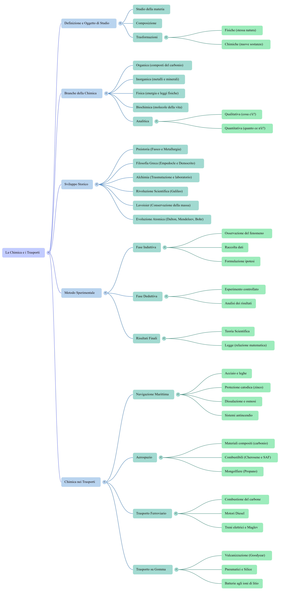

# Sintesi del Modulo 1

*La chimica è la scienza che studia la materia, le sue proprietà e le sue trasformazioni. Nel corso del Modulo 1 abbiamo scoperto come la chimica sia presente nei trasporti, nei materiali, nei carburanti, nella sicurezza e nella sostenibilità.*

## Obiettivi di apprendimento

- Ripassare i concetti fondamentali del modulo.
- Collegare i temi studiati ai Trasporti e alla Logistica.
- Consolidare il metodo scientifico.
- Prepararsi alle unità successive.

# I concetti fondamentali

## Materia e trasformazioni

La materia occupa uno spazio e possiede una massa. Tutti i materiali utilizzati nei trasporti sono costituiti da materia e possono subire trasformazioni fisiche o chimiche.

## La chimica nella vita quotidiana

La chimica è presente:

- nei carburanti;
- nei materiali strutturali;
- nelle batterie;
- nei sistemi di protezione dalla corrosione;
- nei processi di manutenzione.

## Dalle civiltà antiche alla chimica moderna

L'uso del fuoco, la lavorazione dei metalli e la nascita del metodo scientifico hanno contribuito allo sviluppo della chimica come disciplina scientifica.

# Il metodo scientifico

Le fasi principali sono:

1. osservazione;
2. formulazione del problema;
3. ipotesi;
4. esperimento;
5. raccolta dati;
6. analisi;
7. conclusione.

## Il ruolo della misura

Una misura deve essere:

- osservabile;
- misurabile;
- ripetibile;
- documentabile.

# Chimica e Trasporti

## Materiali

I mezzi di trasporto utilizzano:

- acciai speciali;
- leghe leggere;
- materiali compositi;
- elastomeri.

## Carburanti

I carburanti devono essere controllati per garantire:

- sicurezza;
- efficienza;
- sostenibilità.

## Corrosione

La corrosione rappresenta uno dei principali problemi per strutture navali, ferroviarie e industriali.

# Sicurezza e sostenibilità

La chimica permette di:

- prevenire incidenti;
- controllare sostanze pericolose;
- ridurre l'impatto ambientale;
- migliorare l'efficienza energetica.

# Mappa di sintesi

# Infografica

# Risorse multimediali

## Podcast

[Podcast della lezione](../risorse/audio/l1_12_audio_1.m4a)

## Video

[Video della lezione](../risorse/video/l1_12_video_1.mp4)

## Presentazione

[Presentazione della lezione](../risorse/presentazioni/l1_12_presentazione_1.pptx)

## Scheda operativa

[Scheda operativa](../risorse/schede/l1_12_scheda_operativa.docx)

# Attività

1. Costruisci una mappa concettuale dell'intero modulo.
2. Collega ogni argomento studiato a un'applicazione nei Trasporti e nella Logistica.
3. Prepara una breve relazione tecnica su un materiale utilizzato nei mezzi di trasporto.

# Verifica finale

1. Che cosa studia la chimica?
2. Qual è la differenza tra trasformazione fisica e chimica?
3. Quali sono le fasi del metodo scientifico?
4. Perché la misura è importante?
5. Quale ruolo svolge la chimica nella sicurezza dei trasporti?

# Parole chiave

- Materia
- Trasformazione
- Metodo scientifico
- Misura
- Materiali
- Carburanti
- Corrosione
- Sicurezza
- Logistica
- Sostenibilità

## Conclusione

Il Modulo 1 ha introdotto i fondamenti della chimica e il loro legame con il mondo dei Trasporti e della Logistica. Le conoscenze acquisite costituiranno la base per gli approfondimenti successivi.
