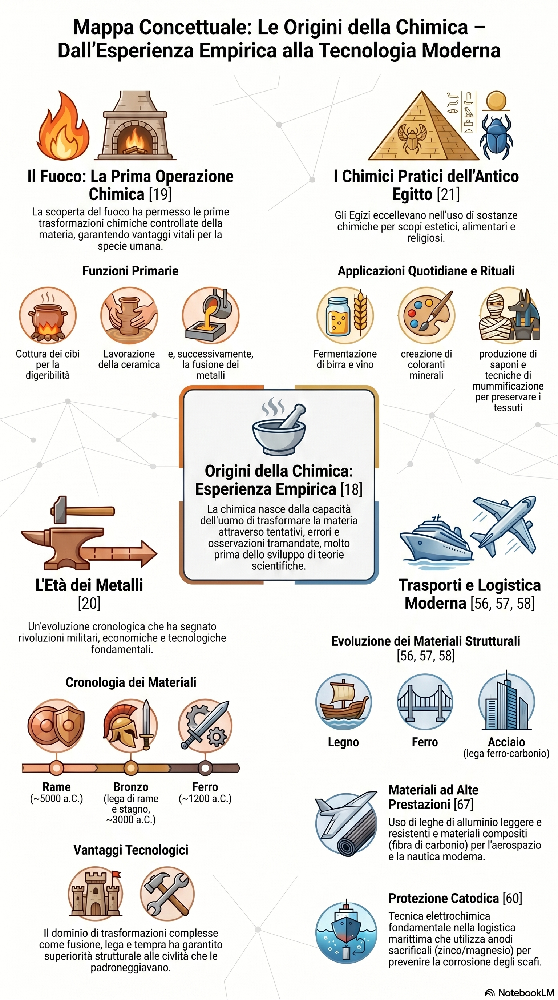

# Dalle origini della chimica alle prime civiltà

*La chimica non nasce nei laboratori moderni. Le sue radici affondano nella storia dell'umanità, quando l'uomo imparò a osservare la materia e a trasformarla per rispondere a bisogni concreti. La scoperta del fuoco, la produzione della ceramica, la lavorazione dei metalli e le prime tecnologie delle civiltà antiche rappresentano il passaggio dalla semplice osservazione della natura alla trasformazione intenzionale dei materiali.*

## Obiettivi di apprendimento

Al termine della lezione sarai in grado di:

- descrivere le origini storiche della chimica come pratica di trasformazione della materia;
- spiegare perché il fuoco rappresenta la prima grande operazione chimica controllata;
- riconoscere il ruolo della ceramica e della metallurgia nello sviluppo delle civiltà;
- distinguere le principali tappe dell'Età dei Metalli: rame, bronzo e ferro;
- comprendere il concetto di lega metallica;
- collegare le tecnologie antiche ai materiali utilizzati nei moderni sistemi di trasporto.

# La chimica prima della scienza

Oggi definiamo la **chimica** come la scienza che studia la materia, la sua composizione, le sue proprietà e le sue trasformazioni. Tuttavia, molto prima che esistessero laboratori, strumenti di misura e teorie scientifiche, gli esseri umani trasformavano la materia in modo pratico.

La conoscenza antica non nasceva da formule o modelli teorici, ma da:

- osservazione della natura;
- esperienza quotidiana;
- tentativi ed errori;
- trasmissione delle tecniche da una generazione all'altra.

Questa fase può essere considerata una forma di chimica empirica: l'uomo non sapeva ancora spiegare perché la materia cambiasse, ma imparava a riconoscere quali condizioni producevano certi risultati.

::: {.callout-note title="Idea guida"}
La chimica nasce come risposta pratica a un problema: trasformare la materia per renderla più utile, resistente, conservabile o adatta al trasporto.
:::

# Osservare la materia

L'uomo antico osservò che alcuni materiali cambiavano quando venivano:

- riscaldati;
- raffreddati;
- mescolati;
- esposti all'aria;
- immersi nell'acqua;
- lavorati con strumenti.

Queste osservazioni portarono allo sviluppo delle prime tecnologie.

Ancora oggi, nella chimica moderna, l'osservazione è il punto di partenza del metodo scientifico. Cambiano gli strumenti, ma resta lo stesso atteggiamento: guardare i fenomeni, descriverli, confrontarli e interpretarli.

# Il fuoco: la prima grande trasformazione controllata

La scoperta e il controllo del fuoco rappresentano una delle svolte più importanti nella storia dell'umanità.

Il fuoco permise all'uomo di modificare la materia in modo intenzionale.

## A che cosa serviva il fuoco

Il fuoco consentì di:

- cuocere gli alimenti;
- riscaldare gli ambienti;
- difendersi dagli animali;
- illuminare;
- indurire materiali;
- trasformare argilla e minerali;
- lavorare i metalli.

Il fuoco fu quindi molto più di una fonte di calore: fu il primo grande strumento tecnologico.

## Il fuoco come laboratorio chimico

Dal punto di vista chimico, il fuoco è legato alla **combustione**, una trasformazione chimica in cui una sostanza reagisce con un comburente, liberando energia.

Gli uomini antichi non conoscevano questo meccanismo, ma impararono a sfruttarne gli effetti.

Quando un materiale viene riscaldato, può:

- cambiare stato;
- perdere acqua;
- indurirsi;
- fondere;
- bruciare;
- trasformarsi in una sostanza nuova.

Il fuoco rappresenta quindi il primo grande laboratorio della storia.

# La ceramica: trasformare l'argilla

Una delle prime tecnologie basate sul fuoco fu la produzione della ceramica.

L'argilla, modellata e poi cotta ad alta temperatura, diventa un materiale più duro e resistente.

## Che cosa cambia nell'argilla

Durante la cottura:

- l'argilla perde acqua;
- la struttura del materiale si modifica;
- aumenta la durezza;
- aumenta la resistenza;
- il materiale diventa più stabile nel tempo.

La ceramica permise di costruire recipienti, anfore e contenitori.

## Ceramica e trasporto delle merci

La ceramica ebbe un ruolo importante nello sviluppo dei commerci.

Anfore e recipienti consentivano di conservare e trasportare:

- acqua;
- olio;
- vino;
- cereali;
- spezie;
- sostanze coloranti.

In questo senso, la trasformazione chimica della materia contribuì allo sviluppo della logistica antica.

# L'Età dei Metalli

Dopo il controllo del fuoco, una delle più grandi rivoluzioni tecnologiche fu la lavorazione dei metalli.

L'uomo imparò progressivamente a estrarre metalli dai minerali, fonderli, modellarli e migliorarne le proprietà.

## L'Età del Rame

Il rame fu uno dei primi metalli utilizzati.

Era apprezzato perché:

- era relativamente facile da lavorare;
- poteva essere modellato;
- si trovava anche allo stato nativo;
- permetteva di costruire utensili più efficaci della pietra.

Tuttavia, il rame era abbastanza tenero e non sempre adatto a strumenti sottoposti a forti sollecitazioni.

## L'Età del Bronzo

Una svolta decisiva avvenne con la scoperta del bronzo.

Il **bronzo** è una lega ottenuta principalmente da rame e stagno.

## Che cos'è una lega

Una **lega** è un materiale ottenuto combinando due o più elementi, almeno uno dei quali metallico.

Le leghe sono importanti perché consentono di migliorare le proprietà dei metalli.

Il bronzo, rispetto al rame:

- è più duro;
- è più resistente;
- mantiene una buona lavorabilità;
- è più adatto alla produzione di utensili e armi.

## L'Età del Ferro

Il ferro segnò una nuova fase dello sviluppo tecnologico.

Rispetto al bronzo, il ferro era:

- più abbondante;
- potenzialmente più resistente;
- adatto a costruire strumenti robusti.

La sua lavorazione richiedeva però temperature più elevate e tecniche più complesse.

L'Età del Ferro dimostra come il progresso tecnico dipenda dalla capacità di controllare meglio la trasformazione della materia.

# La metallurgia

La **metallurgia** è l'insieme delle tecniche che permettono di estrarre, fondere, purificare e lavorare i metalli.

Può essere considerata una delle prime grandi applicazioni della chimica.

## Estrazione dai minerali

Molti metalli non si trovano puri in natura, ma combinati con altre sostanze nei minerali.

Attraverso il calore e specifiche tecniche di lavorazione, l'uomo imparò a separare il metallo dalle impurità.

## Fusione e modellazione

La fusione permetteva di trasformare un metallo solido in liquido e poi versarlo in stampi.

In questo modo era possibile ottenere oggetti con forma definita.

## Controllo delle proprietà

Con l'esperienza gli artigiani compresero che le proprietà dei metalli dipendevano da:

- composizione;
- temperatura di lavorazione;
- tempi di riscaldamento;
- modalità di raffreddamento;
- presenza di altri metalli.

Queste osservazioni sono alla base della moderna scienza dei materiali.

# Le civiltà antiche e la chimica pratica

Le prime civiltà svilupparono numerose tecniche basate sulla trasformazione della materia.

## Gli Egizi

Gli Egizi usarono conoscenze pratiche di chimica per:

- lavorare metalli;
- produrre pigmenti;
- colorare tessuti;
- conservare alimenti;
- preparare cosmetici;
- produrre vetro;
- realizzare materiali decorativi.

I pigmenti ricavati da minerali permisero decorazioni, affreschi e manufatti di grande durata.

## Il vetro

La produzione del vetro richiedeva la trasformazione di sabbia e minerali attraverso alte temperature.

Il vetro è un esempio importante di materiale artificiale prodotto grazie al controllo del calore.

## Conservazione e materiali

Le civiltà antiche svilupparono tecniche per conservare cibi, sostanze e manufatti.

Anche queste pratiche erano legate alla conoscenza empirica delle trasformazioni della materia.

# I Greci e la riflessione sulla materia

Accanto alla chimica pratica delle civiltà antiche si sviluppò anche una riflessione filosofica sulla natura della materia.

I filosofi greci cercarono di rispondere a domande fondamentali:

- di che cosa è fatto il mondo?
- la materia è continua o divisibile?
- esistono particelle minime?
- perché i materiali hanno proprietà diverse?

## Democrito e l'idea di atomo

Democrito ipotizzò che la materia fosse costituita da particelle piccolissime e indivisibili: gli **atomi**.

Questa idea non era ancora una teoria scientifica, perché mancavano prove sperimentali, ma rappresentò un'intuizione fondamentale.

Molti secoli dopo, la chimica moderna riprenderà il concetto di atomo su basi sperimentali.

# Dalle antiche tecniche ai trasporti moderni

Le tecnologie antiche non sono lontane dal mondo dei trasporti.

Ogni mezzo moderno è il risultato della scelta, trasformazione e controllo dei materiali.

## Dal legno all'acciaio

Le prime imbarcazioni erano costruite con legno, fibre vegetali e resine naturali.

Le navi moderne utilizzano:

- acciai speciali;
- leghe leggere;
- rivestimenti protettivi;
- materiali compositi.

Il principio è lo stesso: scegliere e trasformare la materia per ottenere mezzi più resistenti, sicuri ed efficienti.

## Acciaio e corrosione

L'acciaio, lega di ferro e carbonio, è fondamentale per navi, ponti, rotaie e infrastrutture.

Tuttavia, come il ferro antico, può subire corrosione.

Per questo motivo la chimica dei materiali è essenziale anche nella manutenzione moderna.

## Materiali compositi

Nei trasporti aeronautici e automobilistici si utilizzano materiali compositi, come fibre di carbonio e resine.

Questi materiali rappresentano l'evoluzione moderna della ricerca di materiali più leggeri, resistenti e adatti a specifiche funzioni.

# Chimica e Trasporti: ieri e oggi

| Antichità | Funzione | Trasporti moderni |
|---|---|---|
| Fuoco | Trasformare materiali | Combustione, processi industriali |
| Ceramica | Conservare e trasportare merci | Contenitori tecnici e materiali speciali |
| Bronzo | Migliorare resistenza | Leghe metalliche |
| Ferro | Costruire strutture robuste | Acciai per scafi, rotaie e ponti |
| Resine naturali | Impermeabilizzare | Polimeri e rivestimenti protettivi |

# Infografiche

{fig-width=95%}

{fig-width=95%}

# Risorse multimediali

## Podcast

[Dalla ruggine alla fibra di carbonio](../risorse/audio/l1_04_audio_1.m4a)

## Video

[Chimica e Trasporti](../risorse/video/l1_04_video_1.mp4)

[Le radici della chimica](../risorse/video/l1_04_video_2.mp4)

## Presentazione

[Forging Civilization](../risorse/presentazioni/l1_04_presentazione_1.pptx)

## Scheda operativa

[Scheda operativa](../risorse/schede/l1_04_scheda_operativa.docx)

# Attività

## Attività 1 — Linea del tempo

Costruisci una linea del tempo con le seguenti tappe:

- controllo del fuoco;
- produzione della ceramica;
- Età del Rame;
- Età del Bronzo;
- Età del Ferro;
- metallurgia antica;
- materiali moderni nei trasporti.

Per ogni tappa indica:

- materiale principale;
- trasformazione della materia;
- utilità tecnica.

## Attività 2 — Dal bronzo all'acciaio

Confronta bronzo e acciaio.

Indica:

- composizione;
- proprietà principali;
- applicazioni storiche o moderne;
- vantaggi tecnici.

## Attività 3 — Chimica nei trasporti antichi e moderni

Scegli un mezzo di trasporto antico e un mezzo moderno.

Descrivi:

- materiali utilizzati;
- problemi tecnici;
- soluzioni adottate;
- ruolo della chimica.

# Verifica formativa

## Domande a risposta breve

1. Perché il fuoco può essere considerato il primo grande strumento chimico dell'umanità?
2. Che cosa cambia quando l'argilla viene cotta?
3. Che cos'è una lega metallica?
4. Perché il bronzo era più utile del rame per molti strumenti?
5. Quale ruolo ebbe il ferro nello sviluppo delle civiltà?
6. Che cosa studia la metallurgia?
7. Perché gli Egizi possono essere considerati esperti di chimica pratica?
8. Quale intuizione introdusse Democrito?
9. In che modo le tecniche antiche sono collegate ai materiali moderni?
10. Perché lo studio storico della chimica è utile per un tecnico dei trasporti?

## Quesiti a scelta multipla

1. La prima grande trasformazione controllata della materia fu:
   A. la produzione della plastica  
   B. il controllo del fuoco  
   C. la scoperta dell'elettricità  
   D. la costruzione del motore a scoppio  

2. Il bronzo è:
   A. un elemento puro  
   B. una lega di rame e stagno  
   C. un tipo di ceramica  
   D. un minerale combustibile  

3. La ceramica nasce dalla trasformazione di:
   A. argilla riscaldata  
   B. ferro ossidato  
   C. rame e stagno  
   D. gomma vulcanizzata  

4. La metallurgia riguarda:
   A. solo lo studio dei liquidi  
   B. l'estrazione e la lavorazione dei metalli  
   C. la produzione di carburanti  
   D. la classificazione degli organismi viventi  

5. Democrito è importante perché:
   A. formulò la legge di conservazione della massa  
   B. introdusse l'idea filosofica di atomo  
   C. scoprì l'acciaio inox  
   D. inventò la ceramica  

# Soluzioni essenziali

## Domande a risposta breve

1. Perché permette di trasformare intenzionalmente materiali naturali.
2. Perde acqua, indurisce e acquista nuove proprietà.
3. È un materiale ottenuto combinando due o più elementi, almeno uno metallico.
4. Perché è più resistente e durevole.
5. Permise strumenti e strutture più robuste.
6. Studia estrazione, fusione, purificazione e lavorazione dei metalli.
7. Perché svilupparono tecniche su metalli, pigmenti, vetro, conservazione e materiali.
8. L'idea che la materia fosse composta da particelle indivisibili.
9. Entrambe cercano di modificare la materia per ottenere proprietà utili.
10. Perché mostra l'origine tecnica delle scelte sui materiali.

## Quesiti a scelta multipla

1. B  
2. B  
3. A  
4. B  
5. B  

# Parole chiave

- Chimica empirica
- Fuoco
- Combustione
- Ceramica
- Metallurgia
- Rame
- Bronzo
- Ferro
- Lega
- Atomo
- Democrito
- Vetro
- Pigmenti
- Acciaio
- Materiali compositi

# Sintesi finale

La chimica nasce come pratica di trasformazione della materia molto prima di diventare una scienza moderna. Il controllo del fuoco, la produzione della ceramica, la metallurgia e le tecnologie delle prime civiltà mostrano come l'uomo abbia imparato progressivamente a modificare materiali naturali per renderli più utili. Queste esperienze sono alla base della moderna scienza dei materiali e trovano applicazione diretta nei trasporti: dagli scafi in acciaio alle leghe leggere, dai rivestimenti protettivi ai materiali compositi.

## Prosegui il percorso

- [Lezione 1.5](lezione_1_5.qmd)
- [Glossario](../glossario.qmd)
- [Esercizi Modulo 1](../esercizi/esercizi_modulo1.qmd)
- [Bibliografia](../bibliografia.qmd)
