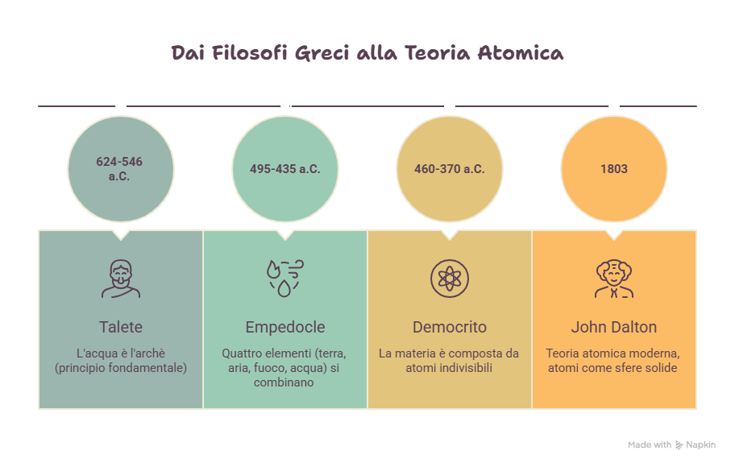
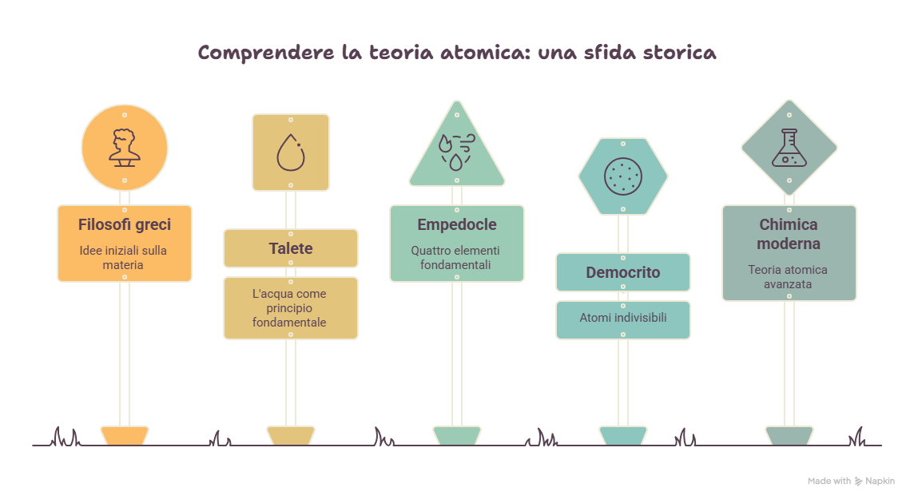
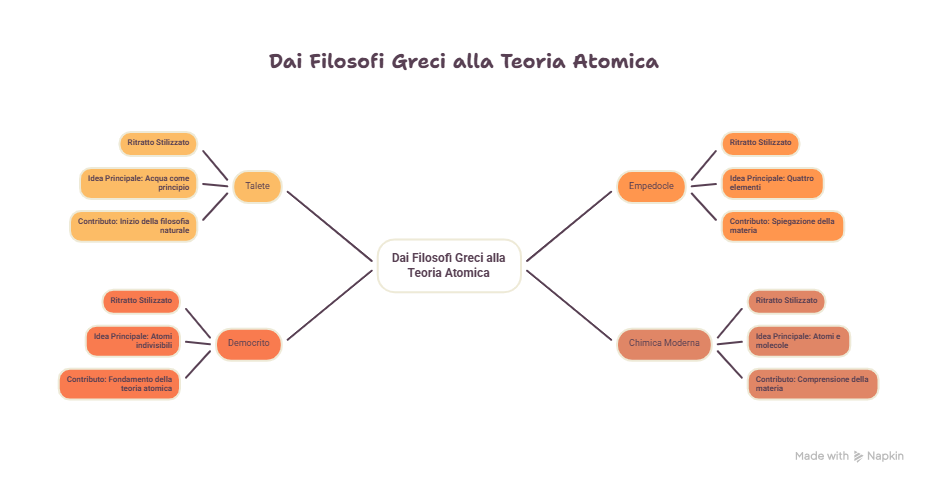
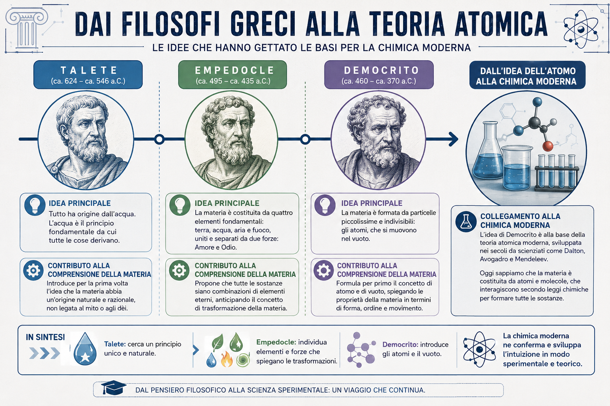
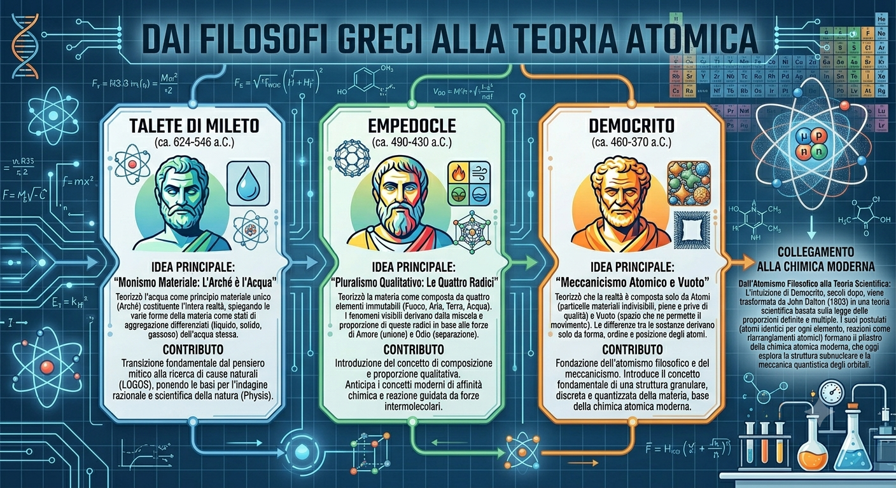

# I filosofi greci, l'atomo e il metodo scientifico

*La chimica moderna nasce quando il desiderio di comprendere la materia incontra l'esigenza di verificare le idee con osservazioni, misure ed esperimenti. In questa lezione il percorso parte dai filosofi greci, attraversa l'intuizione atomica di Democrito e arriva alla svolta metodologica di Galileo e Lavoisier. Il filo conduttore è il passaggio dal pensiero astratto alla diagnosi tecnica: ciò che oggi permette di scegliere materiali, controllare carburanti, prevenire corrosione e documentare i fenomeni nei Trasporti e nella Logistica.*

## Obiettivi di apprendimento

Al termine della lezione sarai in grado di:

- descrivere le principali idee dei filosofi greci sulla materia;
- distinguere la teoria dei quattro elementi dall'intuizione atomica di Democrito;
- spiegare il significato storico del termine **atomo**;
- comprendere il passaggio dalla speculazione filosofica al metodo sperimentale;
- collegare l'idea di struttura della materia alle proprietà dei materiali tecnici;
- riconoscere il ruolo di Galileo e Lavoisier nella nascita della scienza moderna;
- utilizzare esempi del settore Trasporti e Logistica per interpretare il rapporto tra materia, struttura e comportamento.

## Collegamenti nel modulo

Questa lezione prosegue il percorso storico avviato nella lezione precedente. Dopo il fuoco, la ceramica, la metallurgia e le prime civiltà, l'attenzione si sposta sul modo in cui l'essere umano ha iniziato a chiedersi di che cosa fosse fatta la materia.

- Lezione precedente: [Lezione 1.4 — Dalle origini della chimica alle prime civiltà](lezione_1_4.qmd)
- Lezione successiva: [Lezione 1.6](lezione_1_6.qmd)
- Glossario generale: [Glossario](../glossario.qmd)
- Esercizi del Modulo 1: [Esercizi del Modulo 1](../esercizi/esercizi_modulo1.qmd)

# Dal sapere pratico al pensiero sulla materia

Le prime civiltà avevano imparato a trasformare la materia prima ancora di possedere una teoria scientifica.

Sapevano:

- cuocere l'argilla;
- fondere metalli;
- produrre leghe;
- utilizzare pigmenti;
- conservare alimenti;
- costruire utensili e mezzi di trasporto.

Queste pratiche erano basate sull'esperienza. Funzionavano perché gli artigiani osservavano i risultati, ripetevano le procedure utili e tramandavano le tecniche.

Con i filosofi greci nasce però una domanda nuova: **qual è il principio fondamentale della materia?**

Non si tratta più soltanto di trasformare i materiali, ma di comprendere di che cosa siano fatti.

::: {.callout-note title="Idea guida"}
La chimica moderna non nasce improvvisamente. Si sviluppa lentamente dal passaggio tra tre livelli: pratica tecnica, pensiero razionale e verifica sperimentale.
:::

# Talete e la ricerca dell'archè

Uno dei primi filosofi a interrogarsi sulla natura della materia fu Talete di Mileto.

Talete cercava un principio originario, chiamato **archè**, da cui derivassero tutte le cose.

Per lui questo principio era l'acqua.

Questa idea oggi non è scientificamente corretta, ma è importante perché rappresenta uno dei primi tentativi di spiegare la realtà con un principio naturale e non con un racconto mitologico.

## Perché l'idea di Talete è importante

Talete non aveva strumenti di laboratorio. Tuttavia il suo modo di ragionare introduce un passaggio fondamentale:

- osservare la natura;
- individuare una regolarità;
- cercare una spiegazione razionale.

Questo atteggiamento anticipa, in forma ancora filosofica, il bisogno di interpretare la materia con criteri ordinati.

# Empedocle e i quattro elementi

Empedocle propose che la materia fosse composta da quattro elementi fondamentali:

- terra;
- acqua;
- aria;
- fuoco.

Secondo questa visione, tutte le sostanze derivavano dalla diversa combinazione di questi elementi.

La teoria dei quattro elementi ebbe grande influenza nella storia del pensiero, ma non era fondata su esperimenti quantitativi.

## Un modello semplice, ma non sperimentale

Il modello di Empedocle era intuitivo perché collegava la materia a elementi visibili e familiari.

Tuttavia presentava un limite decisivo: non permetteva di verificare con misure precise la composizione reale delle sostanze.

Nel linguaggio della scienza moderna, era un modello deduttivo e qualitativo, non un modello sperimentale.

# Aristotele e il peso dell'autorità

Aristotele riprese e rielaborò la teoria dei quattro elementi, collegandola a qualità come:

- caldo;
- freddo;
- secco;
- umido.

Per molti secoli il pensiero aristotelico influenzò il modo di interpretare la materia.

Il problema non era soltanto il contenuto del modello, ma il metodo: le spiegazioni venivano spesso accettate per l'autorità del filosofo, non perché confermate da esperimenti controllati.

## Dall'autorità alla verifica

La scienza moderna nascerà proprio quando il sapere inizierà a essere valutato non in base all'autorità di chi lo propone, ma in base alla verifica dei fatti.

Questo passaggio sarà fondamentale anche per la chimica.

# Democrito e l'intuizione dell'atomo

Democrito propose un'idea radicalmente diversa.

Secondo lui la materia non era continua, ma composta da particelle piccolissime e indivisibili: gli **atomi**.

Il termine deriva dal greco *atomos*, che significa "indivisibile".

Democrito immaginava che le proprietà dei corpi dipendessero da:

- forma degli atomi;
- dimensione degli atomi;
- disposizione nello spazio;
- modo in cui gli atomi si combinano.

Questa intuizione non era ancora una teoria scientifica moderna, perché mancavano prove sperimentali. Tuttavia fu straordinariamente importante.

## L'atomo come idea strutturale

L'aspetto più interessante dell'intuizione di Democrito è che le proprietà macroscopiche della materia vengono collegate alla disposizione microscopica delle sue parti.

In altre parole:

> la struttura interna determina il comportamento esterno.

Questa idea è centrale nella chimica moderna e nella scienza dei materiali.

# Information Design della materia

Nel progetto "Chimica per i Trasporti e la Logistica", l'intuizione di Democrito può essere spiegata con una analogia tecnica: il **piano di carico** di una nave.

In un piano di carico non conta soltanto quale merce viene trasportata, ma anche:

- dove viene collocata;
- come viene distribuita;
- come interagisce con il resto del carico;
- come influenza la stabilità complessiva.

Allo stesso modo, nella materia non conta soltanto quali atomi sono presenti, ma anche come sono organizzati.

## Esempio tecnico

Due materiali possono contenere elementi simili, ma avere proprietà diverse a causa della loro struttura.

Nel settore dei trasporti questo principio è fondamentale per comprendere:

- acciai;
- leghe leggere;
- materiali compositi;
- gomme vulcanizzate;
- rivestimenti protettivi.

::: {.callout-tip title="Analogia T&L"}
Gli atomi in un materiale possono essere immaginati come unità di carico in una nave: la stabilità del sistema dipende non solo da che cosa è presente, ma da come è disposto.
:::

# Dai filosofi alla scienza moderna

I filosofi greci introdussero domande fondamentali sulla materia, ma non disponevano del metodo sperimentale moderno.

La loro indagine era basata soprattutto su:

- osservazione generale;
- ragionamento;
- deduzione;
- autorità del pensiero.

La chimica moderna richiederà un cambiamento decisivo: passare dalla domanda "che cosa penso della materia?" alla domanda "che cosa posso verificare sulla materia?"

# Galileo e la svolta metodologica

Galileo Galilei introdusse una nuova idea di conoscenza scientifica.

Per Galileo non bastava ragionare sulla natura: occorreva osservarla, misurarla e verificarla.

La sua impostazione si fonda su tre criteri fondamentali:

- osservabilità;
- misurabilità;
- ripetibilità.

Questi criteri sono ancora oggi alla base del lavoro scientifico.

## Sensata esperienza

Con l'espressione **sensata esperienza** si indica il ruolo dell'osservazione concreta.

Il dato non deve essere immaginato, ma osservato.

## Necessarie dimostrazioni

Le osservazioni devono essere organizzate attraverso ragionamenti, misure e verifiche.

La conoscenza scientifica nasce quindi dall'unione tra esperienza e metodo.

# Il metodo sperimentale

Il metodo sperimentale può essere descritto come un percorso ordinato.

1. Osservazione del fenomeno.
2. Formulazione di una domanda.
3. Elaborazione di un'ipotesi.
4. Progettazione dell'esperimento.
5. Raccolta dei dati.
6. Analisi dei risultati.
7. Conferma, modifica o rifiuto dell'ipotesi.

## Un processo ricorsivo

Il metodo scientifico non è una linea retta.

Se i dati non confermano l'ipotesi, occorre tornare indietro e riformularla.

Questo rende la scienza un processo di autocorrezione.

# Lavoisier e la chimica quantitativa

Antoine Lavoisier segnò una svolta decisiva nella storia della chimica.

Il suo contributo principale fu l'introduzione sistematica della misura quantitativa nello studio delle trasformazioni chimiche.

Lo strumento simbolo di questa rivoluzione è la bilancia.

## La legge di conservazione della massa

Lavoisier dimostrò che, in un sistema chiuso, durante una reazione chimica la massa totale si conserva.

La materia non scompare e non si crea dal nulla: si trasforma.

Questa idea può essere sintetizzata così:

> Nulla si crea, nulla si distrugge, tutto si trasforma.

## Analogia logistica

La legge di Lavoisier può essere spiegata con il bilanciamento di un carico.

In una nave o in un magazzino:

- ciò che entra deve essere registrato;
- ciò che esce deve essere controllato;
- la differenza deve essere giustificata.

Allo stesso modo, in una reazione chimica, gli atomi presenti nei reagenti devono ritrovarsi nei prodotti, anche se organizzati in modo diverso.

# Legge e teoria

Nel linguaggio scientifico, **legge** e **teoria** non sono sinonimi.

## Legge scientifica

Una legge descrive una regolarità osservata.

Risponde soprattutto alla domanda: **come avviene un fenomeno?**

## Teoria scientifica

Una teoria spiega un insieme di fenomeni collegati.

Risponde soprattutto alla domanda: **perché avviene un fenomeno?**

::: {.callout-important title="Attenzione"}
Nel linguaggio comune "teoria" può significare opinione. Nel linguaggio scientifico, invece, una teoria è una spiegazione fondata su molte osservazioni e prove.
:::

# Dal pensiero atomico ai materiali moderni

L'intuizione atomica di Democrito anticipa un principio centrale della chimica contemporanea: le proprietà dei materiali dipendono dalla struttura della materia.

Questo concetto è fondamentale nei trasporti.

## Acciai e leghe

La resistenza di un acciaio dipende dalla composizione e dall'organizzazione interna del materiale.

La presenza di elementi come carbonio e cromo modifica le proprietà della lega.

## Gomma e vulcanizzazione

La gomma naturale può essere migliorata attraverso la vulcanizzazione.

Durante questo processo si formano collegamenti tra le catene polimeriche, rendendo il materiale più elastico e resistente.

## Materiali compositi

Nei materiali compositi, come fibra di carbonio e resine epossidiche, le proprietà dipendono dall'organizzazione tra rinforzo e matrice.

Anche qui la struttura interna determina il comportamento del materiale.

# Caso T&L — Aumento dei consumi di una nave

Una nave consuma più carburante rispetto ai valori previsti.

Un tecnico non deve limitarsi a formulare un'opinione.

Deve procedere con metodo.

## Osservazione

Il consumo medio è aumentato rispetto ai viaggi precedenti.

## Ipotesi

L'aumento potrebbe dipendere da incrostazioni biologiche sullo scafo o sull'elica.

## Verifica

Si esegue un'ispezione subacquea.

## Esperimento operativo

Si confrontano i consumi prima e dopo la pulizia dello scafo.

## Conclusione

Se dopo la pulizia i consumi tornano vicini ai valori normali, l'ipotesi è supportata dai dati.

Questo esempio mostra come il metodo scientifico diventi uno strumento di diagnostica tecnica.

# Mappa concettuale della lezione

# Infografiche

# Risorse multimediali

## Podcast

[L'atomo immaginato prima della tecnologia](../risorse/audio/l1_05_audio_1.m4a)

## Video

[L'evoluzione della materia](../risorse/video/l1_05_video_1.mp4)

## Presentazione

[From Marble to Blueprint](../risorse/presentazioni/l1_05_presentazione_1.pptx)

## Scheda operativa

[Scheda operativa](../risorse/schede/l1_05_scheda_operativa.docx)

# Attività

## Attività 1 — Dal pensiero al modello

Completa la tabella.

| Pensatore | Idea principale | Limite scientifico |
|---|---|---|
| Talete | | |
| Empedocle | | |
| Democrito | | |

## Attività 2 — Atomi e piano di carico

Spiega l'analogia tra:

- atomi in un materiale;
- container in un piano di carico.

Scrivi un breve testo di massimo 10 righe.

## Attività 3 — Diagnostica tecnica

Leggi il caso.

Una nave registra un aumento del 15% dei consumi rispetto alla media. Il motore non mostra guasti evidenti.

Indica:

1. osservazione;
2. ipotesi;
3. prova tecnica;
4. dati da raccogliere;
5. possibile conclusione.

# Verifica formativa

## Domande a risposta breve

1. Che cosa intendeva Talete con il termine archè?
2. Quali erano i quattro elementi di Empedocle?
3. Perché l'idea di Democrito è importante per la chimica moderna?
4. Che cosa significa *atomos*?
5. Qual è la differenza tra ragionamento filosofico e metodo sperimentale?
6. Quali criteri caratterizzano il metodo scientifico moderno?
7. Quale ruolo ebbe la bilancia nel lavoro di Lavoisier?
8. Che cosa afferma la legge di conservazione della massa?
9. Qual è la differenza tra legge e teoria scientifica?
10. In che modo la struttura della materia influenza le proprietà dei materiali?

## Quesiti a scelta multipla

1. Talete individuava come principio fondamentale della realtà:
   A. il fuoco  
   B. l'acqua  
   C. l'aria  
   D. il ferro  

2. Secondo Empedocle, la materia era composta da:
   A. atomi e molecole  
   B. elettroni e protoni  
   C. terra, acqua, aria e fuoco  
   D. metalli e sali  

3. Democrito immaginò che la materia fosse formata da:
   A. cellule  
   B. atomi indivisibili  
   C. quattro liquidi fondamentali  
   D. particelle elettriche misurabili  

4. Il metodo sperimentale richiede:
   A. autorità e tradizione  
   B. osservazione, misura e verifica  
   C. soltanto intuizione  
   D. memorizzazione di formule  

5. Lavoisier è importante perché:
   A. introdusse la teoria dei quattro elementi  
   B. introdusse l'uso rigoroso della bilancia nella chimica  
   C. scoprì il bronzo  
   D. inventò il piano di carico  

# Soluzioni essenziali

## Domande a scelta multipla

1. B  
2. C  
3. B  
4. B  
5. B  

## Attività 1

| Pensatore | Idea principale | Limite scientifico |
|---|---|---|
| Talete | L'acqua come principio originario | Mancanza di verifica sperimentale |
| Empedocle | Quattro elementi | Modello qualitativo non misurato |
| Democrito | Materia composta da atomi | Intuizione priva di prove sperimentali moderne |

# Parole chiave

- Archè
- Talete
- Empedocle
- Quattro elementi
- Democrito
- Atomo
- Information Design
- Metodo sperimentale
- Galileo
- Lavoisier
- Legge scientifica
- Teoria scientifica
- Conservazione della massa

# Sintesi finale

La Lezione 1.5 mostra il passaggio dal pensiero filosofico alla scienza sperimentale. I primi filosofi greci cercarono un principio fondamentale della materia; Empedocle propose il modello dei quattro elementi; Democrito intuì l'esistenza di particelle indivisibili, anticipando il concetto moderno di atomo. Con Galileo e Lavoisier la conoscenza della materia diventa sempre più legata a osservazione, misura e verifica. Questo percorso è fondamentale per comprendere la chimica come strumento tecnico nei Trasporti e nella Logistica: conoscere la struttura della materia significa poter progettare materiali, diagnosticare problemi e migliorare sicurezza ed efficienza.

## Prosegui il percorso

- [Lezione 1.6](lezione_1_6.qmd)
- [Glossario](../glossario.qmd)
- [Esercizi Modulo 1](../esercizi/esercizi_modulo1.qmd)
- [Bibliografia](../bibliografia.qmd)
