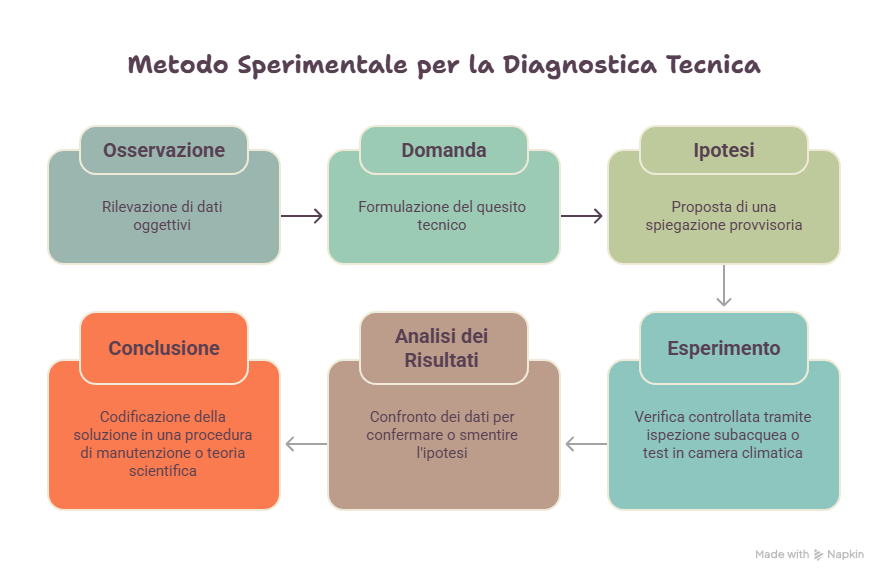
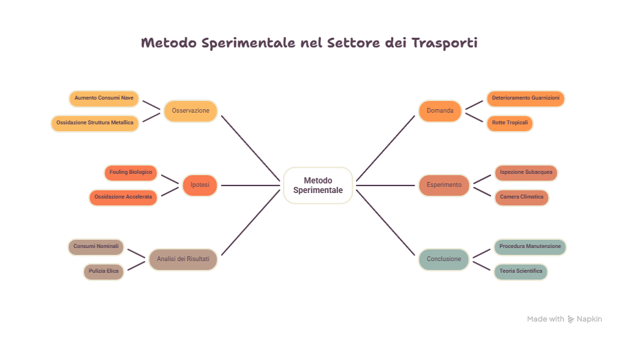

# Il metodo sperimentale: osservazione, ipotesi ed esperimento

*Il metodo sperimentale è il modo con cui la chimica trasforma un'osservazione in conoscenza affidabile. Per un tecnico dei Trasporti e della Logistica non è soltanto un argomento scolastico: è una procedura professionale per diagnosticare problemi, controllare materiali, verificare carburanti, valutare rischi e prendere decisioni fondate su dati.*

## Obiettivi di apprendimento

Al termine della lezione sarai in grado di:

- spiegare che cos'è il metodo sperimentale;
- distinguere osservazione, ipotesi, esperimento, risultato e conclusione;
- riconoscere la differenza tra fatto, ipotesi, teoria e legge;
- individuare variabili indipendenti, dipendenti e di controllo;
- comprendere il valore di osservabilità, misurabilità e ripetibilità;
- applicare il metodo sperimentale a casi tecnici del settore Trasporti e Logistica.

# Perché serve un metodo

La chimica studia la materia e le sue trasformazioni. Tuttavia osservare un fenomeno non basta: occorre interpretarlo correttamente.

Un tecnico può trovarsi davanti a situazioni come:

- una nave consuma più carburante del previsto;
- uno scafo presenta corrosione;
- un campione di carburante contiene impurità;
- uno pneumatico mostra usura anomala;
- una batteria perde efficienza.

In tutti questi casi non è sufficiente formulare un'opinione. Serve un metodo che permetta di passare dall'osservazione alla verifica.

::: {.callout-note title="Idea guida"}

Il metodo sperimentale è una procedura ordinata che permette di controllare se una spiegazione è sostenuta dai dati.

:::

# Osservare non significa interpretare

Il primo passaggio del metodo sperimentale è l'osservazione.

Osservare significa descrivere ciò che si può rilevare in modo oggettivo.

Interpretare significa proporre una spiegazione.

## Esempio

| Frase | Tipo |
|---|---|
| Lo scafo presenta incrostazioni visibili | Osservazione |
| Il maggiore consumo dipende dal biofouling | Ipotesi |
| La temperatura del motore è aumentata di 20 °C | Osservazione |
| Il motore è guasto | Interpretazione |

Confondere osservazione e interpretazione può portare a decisioni errate.

# Le fasi del metodo sperimentale

Il metodo sperimentale può essere descritto come un ciclo.

## 1. Osservazione

Si rileva un fenomeno.

Esempio:

Una nave registra consumi superiori del 15% rispetto ai valori abituali.

## 2. Domanda

Si formula una domanda chiara.

Esempio:

Perché la nave consuma più carburante?

## 3. Ipotesi

Si propone una spiegazione provvisoria e verificabile.

Esempio:

Il consumo è aumentato a causa del biofouling sullo scafo.

## 4. Esperimento

Si progetta una prova controllata.

Esempio:

Si misura il consumo prima e dopo la pulizia dello scafo.

## 5. Raccolta dati

Si registrano valori osservabili e misurabili.

Esempio:

- consumo prima della pulizia;
- consumo dopo la pulizia;
- condizioni operative;
- stato dello scafo.

## 6. Analisi

Si confrontano i dati ottenuti.

## 7. Conclusione

Si valuta se i dati confermano o smentiscono l'ipotesi.

# Il metodo come ciclo ricorsivo

Il metodo sperimentale non è una strada a senso unico.

Se i risultati non confermano l'ipotesi, si torna indietro e si formula una nuova spiegazione.

```{mermaid}
flowchart LR
    A[Osservazione] --> B[Domanda]
    B --> C[Ipotesi]
    C --> D[Esperimento]
    D --> E[Raccolta dati]
    E --> F[Analisi]
    F --> G{Ipotesi confermata?}
    G -->|Sì| H[Conclusione provvisoria]
    G -->|No| C
```

# Fatto, ipotesi, teoria e legge

Nel linguaggio scientifico alcune parole hanno significati precisi.

## Fatto

Un fatto è un dato osservabile.

Esempio:

La massa dell'anodo sacrificale è diminuita dopo il periodo di immersione.

## Ipotesi

Un'ipotesi è una spiegazione provvisoria e testabile.

Esempio:

L'anodo si è ossidato proteggendo lo scafo.

## Teoria

Una teoria è una spiegazione ampia, sostenuta da numerose prove.

## Legge

Una legge descrive una regolarità osservata, spesso esprimibile in forma matematica.

# Variabili sperimentali

Per rendere valido un esperimento occorre controllare le variabili.

## Variabile indipendente

È il fattore che viene modificato o considerato come causa.

Esempio:

Il tipo di rivestimento antivegetativo applicato allo scafo.

## Variabile dipendente

È l'effetto misurato.

Esempio:

La quantità di crescita biologica sulla superficie.

## Variabili di controllo

Sono i fattori mantenuti costanti.

Esempi:

- salinità dell'acqua;
- temperatura;
- tempo di immersione;
- velocità del mezzo;
- superficie esposta.

# Caso studio — Rivestimento antivegetativo

Una compagnia vuole confrontare due rivestimenti per ridurre il biofouling.

| Elemento | Ruolo |
|---|---|
| Tipo di rivestimento | Variabile indipendente |
| Crescita biologica | Variabile dipendente |
| Salinità, temperatura, tempo | Variabili di controllo |

Se cambia anche la temperatura dell'acqua, il risultato potrebbe dipendere dalla temperatura e non dal rivestimento. Per questo motivo il controllo sperimentale è essenziale.

# Osservabilità, misurabilità, ripetibilità

Un'indagine tecnica deve rispettare tre criteri fondamentali.

## Osservabilità

Il fenomeno deve poter essere osservato in modo oggettivo.

## Misurabilità

Il fenomeno deve poter essere espresso con dati.

## Ripetibilità

L'esperimento deve poter essere ripetuto ottenendo risultati coerenti in condizioni analoghe.

::: {.callout-important title="Regola professionale"}

Una decisione tecnica è affidabile solo se deriva da dati osservabili, misurabili e ripetibili.

:::

# Applicazioni nei Trasporti e nella Logistica

## Settore navale

Il metodo sperimentale permette di studiare:

- corrosione degli scafi;
- biofouling;
- efficacia degli anodi sacrificali;
- consumo di carburante.

## Settore aeronautico

Permette di controllare:

- stabilità dei carburanti;
- resistenza dei materiali compositi;
- comportamento delle guarnizioni;
- sicurezza dei componenti.

## Settore stradale

Permette di valutare:

- mescole degli pneumatici;
- resistenza al rotolamento;
- consumo di carburante;
- usura del battistrada.

## Settore logistico

Permette di gestire:

- qualità delle merci;
- sostanze pericolose;
- condizioni di stoccaggio;
- tracciabilità dei controlli.

# Esperienza guidata — Diagnostica tecnica

## Situazione

Una nave consuma più carburante del previsto.

## Compito

Costruisci un'indagine sperimentale.

| Fase | Risposta |
|---|---|
| Osservazione | |
| Domanda | |
| Ipotesi | |
| Esperimento | |
| Dati da raccogliere | |
| Conclusione possibile | |

# Mappe concettuali

{fig-width=95%}

{fig-width=95%}

# Infografica

{fig-width=95%}

# Risorse multimediali

## Podcast

[Perché navi e aerei non si dissolvono](../risorse/audio/l1_07_audio_1.m4a)

## Video

[Chimica nei Trasporti](../risorse/video/l1_07_video_1.mp4)

## Presentazione

[Scientific Logistics Diagnostics](../risorse/presentazioni/l1_07_presentazione_1.pptx)

## Scheda operativa

[Scheda operativa](../risorse/schede/l1_07_scheda_operativa.docx)

# Attività

## Attività 1 — Osservazione o ipotesi?

Classifica le seguenti frasi.

| Frase | Osservazione o ipotesi? |
|---|---|
| Lo scafo presenta incrostazioni visibili | |
| Il consumo è aumentato del 15% | |
| Il biofouling è la causa dell'aumento dei consumi | |
| L'anodo ha perso massa | |

## Attività 2 — Variabili

Per un test su due pneumatici con mescole differenti, individua:

- variabile indipendente;
- variabile dipendente;
- variabili di controllo.

## Attività 3 — Progetta un esperimento

Un campione di carburante presenta impurità. Progetta un'indagine indicando:

1. osservazione;
2. ipotesi;
3. prova sperimentale;
4. dati da raccogliere;
5. conclusione possibile.

# Verifica formativa

## Domande a risposta breve

1. Che cos'è il metodo sperimentale?
2. Qual è la differenza tra osservazione e ipotesi?
3. Che cosa significa che un'ipotesi deve essere testabile?
4. Che cosa sono le variabili di controllo?
5. Perché la ripetibilità è importante?
6. Qual è la differenza tra teoria e legge?
7. Come si applica il metodo sperimentale al biofouling?
8. Perché il tecnico deve distinguere dato e interpretazione?

## Quesiti a scelta multipla

1. Quale frase rappresenta meglio un'osservazione scientifica?
   - A. Il motore sembra avere qualcosa che non va.
   - B. La temperatura dell'olio è aumentata di 20 °C rispetto al valore nominale.
   - C. Il carburante è sicuramente di scarsa qualità.
   - D. La nave consuma troppo perché è vecchia.

2. Un'ipotesi è:
   - A. un'opinione non verificabile;
   - B. una spiegazione provvisoria e testabile;
   - C. una legge matematica definitiva;
   - D. un dato misurato.

3. In un test sugli pneumatici, il consumo di carburante misurato è:
   - A. variabile indipendente;
   - B. variabile dipendente;
   - C. variabile di controllo;
   - D. ipotesi.

4. La ripetibilità indica che:
   - A. l'esperimento può essere rifatto in condizioni analoghe ottenendo risultati coerenti;
   - B. l'esperimento deve sempre confermare l'ipotesi;
   - C. la teoria non può più essere modificata;
   - D. la misura non è necessaria.

# Sintesi finale

Il metodo sperimentale permette di trasformare osservazioni in conoscenze controllate. Attraverso osservazione, ipotesi, esperimento, raccolta dati e analisi, il tecnico può prendere decisioni fondate su evidenze. Nel settore Trasporti e Logistica questo metodo è indispensabile per diagnosticare problemi, verificare materiali, controllare carburanti e migliorare sicurezza ed efficienza.

# Parole chiave

- Metodo sperimentale
- Osservazione
- Ipotesi
- Esperimento
- Dato
- Variabile indipendente
- Variabile dipendente
- Variabili di controllo
- Ripetibilità
- Teoria
- Legge
- Diagnostica tecnica

## Prosegui il percorso

- [Lezione 1.8](lezione_1_8.qmd)
- [Glossario](../glossario.qmd)
- [Esercizi Modulo 1](../esercizi/esercizi_modulo1.qmd)
- [Bibliografia](../bibliografia.qmd)
