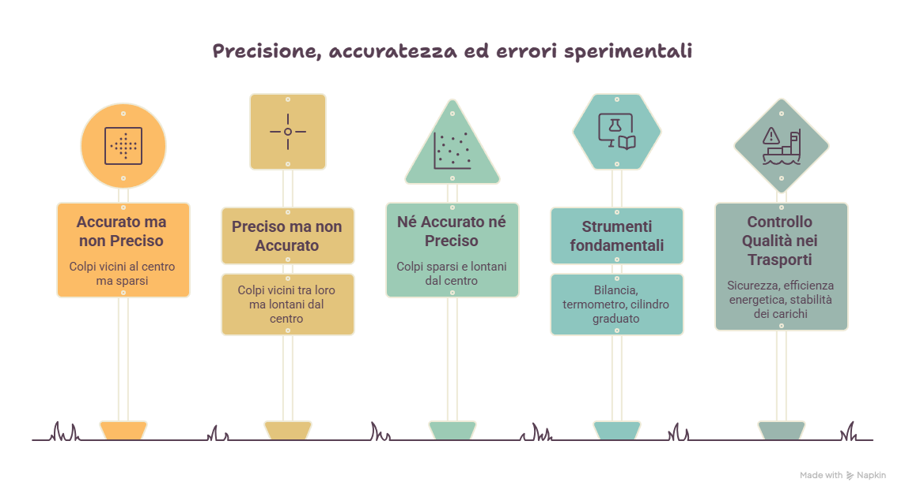
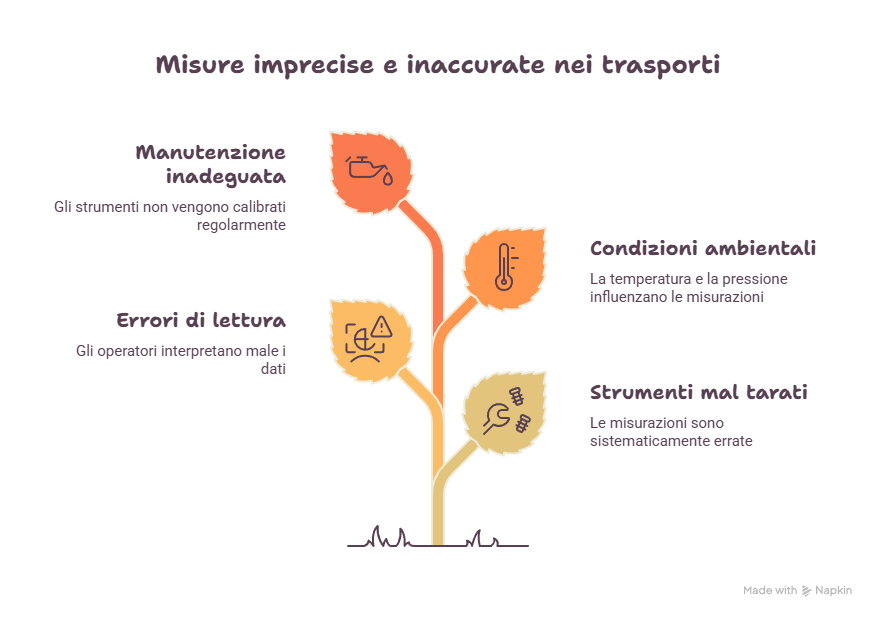
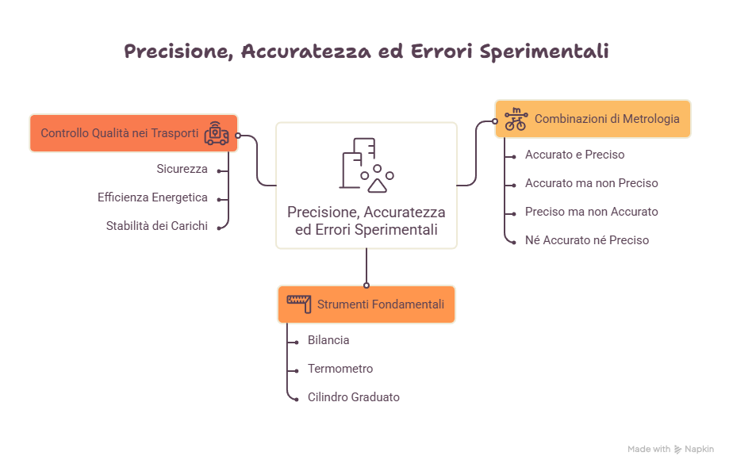

# Metrologia, precisione e accuratezza nel settore Trasporti e Logistica

*La chimica moderna non si limita a osservare la materia: la misura. Nel settore Trasporti e Logistica, una misura corretta può determinare sicurezza, efficienza, qualità del carburante, resistenza dei materiali e affidabilità delle decisioni tecniche. Precisione, accuratezza ed errore non sono parole astratte, ma strumenti professionali per trasformare un dato in una decisione responsabile.*

## Obiettivi di apprendimento

Al termine della lezione sarai in grado di:

- spiegare il significato di misura in ambito chimico e tecnico;
- distinguere precisione e accuratezza;
- riconoscere il ruolo dell'errore sperimentale;
- collegare le misure chimiche alla sicurezza nei trasporti;
- interpretare dati tecnici relativi a materiali, carburanti e processi;
- utilizzare esempi del settore Trasporti e Logistica per comprendere il valore della metrologia.

# Perché misurare

Misurare significa associare a una grandezza un valore numerico e un'unità di misura.

Nel linguaggio tecnico una frase come:

> Il carburante è buono.

non è sufficiente.

È molto più utile dire:

> Il campione presenta impurità inferiori al limite ammesso e possiede una densità compatibile con lo standard previsto.

La misura rende il dato:

- controllabile;
- confrontabile;
- documentabile;
- utilizzabile per prendere decisioni.

::: {.callout-note title="Idea guida"}
Nel settore Trasporti e Logistica una misura non descrive soltanto un fenomeno: permette di decidere se un materiale, un carburante o un sistema è sicuro, efficiente e conforme.
:::

# Dalla chimica qualitativa alla chimica quantitativa

La chimica qualitativa risponde alla domanda:

**Che cosa è presente?**

La chimica quantitativa risponde alla domanda:

**Quanto è presente?**

Entrambe sono necessarie.

## Esempio tecnico

In un campione di carburante:

- l'analisi qualitativa identifica eventuali impurità;
- l'analisi quantitativa misura la loro concentrazione.

Un carburante può contenere una sostanza indesiderata, ma la decisione tecnica dipende dalla quantità rilevata.

# Il dato tecnico

Un dato tecnico completo deve contenere:

- valore numerico;
- unità di misura;
- condizione di misura;
- strumento utilizzato;
- eventuale incertezza;
- riferimento o limite di confronto.

## Esempio

| Dato incompleto | Dato tecnico corretto |
|---|---|
| Il campione è caldo | Temperatura del campione: 65 °C |
| Il carburante è impuro | Impurità: 12 ppm |
| Lo pneumatico consuma meno | Resistenza al rotolamento ridotta del 4% |

# Precisione e accuratezza

Precisione e accuratezza non sono sinonimi.

## Precisione

La precisione indica quanto misure ripetute sono vicine tra loro.

Uno strumento è preciso se, ripetendo più volte la misura, fornisce valori molto simili.

## Accuratezza

L'accuratezza indica quanto una misura è vicina al valore vero o accettato come riferimento.

Una misura è accurata se si avvicina al valore corretto.

## Confronto

| Situazione | Precisione | Accuratezza |
|---|---|---|
| Misure vicine tra loro e vicine al valore vero | Alta | Alta |
| Misure vicine tra loro ma lontane dal valore vero | Alta | Bassa |
| Misure disperse ma intorno al valore vero | Bassa | Possibile |
| Misure disperse e lontane dal valore vero | Bassa | Bassa |

# Errore sperimentale

Ogni misura contiene una certa possibilità di errore.

L'errore non significa necessariamente sbaglio grossolano. In scienza indica la differenza tra il valore misurato e il valore reale o di riferimento.

## Tipi di errore

### Errore sistematico

Si ripete sempre nella stessa direzione.

Esempio:

Una bilancia non tarata indica sempre 20 g in più.

### Errore casuale

Varia in modo imprevedibile tra una misura e l'altra.

Esempio:

Piccole oscillazioni nella lettura di un volume.

### Errore grossolano

Dipende da disattenzione o procedura sbagliata.

Esempio:

Leggere una scala graduata dall'angolazione sbagliata.

# Unità di misura e Sistema Internazionale

Per comunicare in modo tecnico occorre usare unità condivise.

Il Sistema Internazionale permette di evitare ambiguità.

| Grandezza | Unità SI | Applicazione nei trasporti |
|---|---|---|
| Massa | kg | Carico, carburante, materiali |
| Lunghezza | m | Dimensioni, spessori, distanze |
| Tempo | s | Prove, cicli, velocità |
| Temperatura | K | Stabilità termica dei carburanti |
| Quantità di sostanza | mol | Reazioni e bilanciamenti |

# Misure e carburanti

Nel settore aeronautico il cherosene Jet-A1 deve mantenere proprietà adeguate anche a basse temperature.

Il controllo quantitativo permette di verificare:

- densità;
- impurità;
- stabilità termica;
- contenuto di acqua;
- compatibilità con le specifiche operative.

## SAF e densità energetica

I carburanti sostenibili per l'aviazione devono garantire prestazioni compatibili con le esigenze di autonomia e sicurezza.

La misura diventa quindi uno strumento di validazione tecnica.

# Misure e corrosione

La corrosione non si valuta soltanto osservando il colore di una superficie.

Occorre misurare:

- perdita di massa;
- profondità della corrosione;
- tempo di esposizione;
- composizione dell'ambiente;
- efficacia del sistema di protezione.

## Anodi sacrificali

Negli scafi navali gli anodi sacrificali si consumano per proteggere il metallo strutturale.

Misurare la perdita di massa dell'anodo permette di programmare la sostituzione prima che il rischio diventi critico.

# Misure e pneumatici

La composizione della gomma influenza:

- aderenza;
- durata;
- resistenza al rotolamento;
- consumo di carburante.

L'introduzione della silice nelle mescole può contribuire a ridurre la resistenza al rotolamento.

Per dimostrarlo occorrono dati:

- condizioni di prova;
- consumo misurato;
- confronto con un riferimento;
- numero di misure ripetute.

# Variabili e controllo sperimentale

Misurare un fenomeno non basta.

Occorre controllare le condizioni in cui la misura viene effettuata.

## Variabile indipendente

È il fattore che si modifica o si considera come causa.

## Variabile dipendente

È l'effetto misurato.

## Variabili di controllo

Sono i fattori mantenuti costanti.

# Caso studio — Rivestimento antivegetativo

Una compagnia vuole confrontare due rivestimenti per ridurre il biofouling sullo scafo.

| Elemento | Ruolo |
|---|---|
| Tipo di rivestimento | Variabile indipendente |
| Crescita biologica sulla superficie | Variabile dipendente |
| Salinità, temperatura, tempo di immersione, velocità | Variabili di controllo |

Se la temperatura dell'acqua cambia tra una prova e l'altra, il risultato potrebbe non dipendere solo dal rivestimento.

# Caso studio — Aumento dei consumi

Una nave consuma più carburante rispetto ai valori abituali.

## Dati raccolti

| Condizione | Consumo medio |
|---|---|
| Scafo pulito | 1000 kg/h |
| Scafo con incrostazioni | 1150 kg/h |
| Dopo pulizia | 1010 kg/h |

## Interpretazione

Il dato suggerisce che il biofouling abbia aumentato la resistenza all'avanzamento.

Tuttavia la conclusione deve essere prudente: occorre verificare anche carico, rotta, condizioni meteo e stato del motore.

# La misura come decisione tecnica

Una misura corretta può determinare:

- autorizzazione al trasporto;
- manutenzione programmata;
- sostituzione di un componente;
- accettazione o rifiuto di un carburante;
- valutazione del rischio;
- miglioramento dell'efficienza.

::: {.callout-important title="Regola operativa"}
Un dato tecnico deve essere leggibile, verificabile e confrontabile. Senza unità di misura e condizioni di prova, il dato perde valore operativo.
:::

# Mappe concettuali

{fig-width=95%}

{fig-width=95%}

{fig-width=95%}

# Infografica

{fig-width=95%}

# Risorse multimediali

## Podcast

[Podcast della lezione](../risorse/audio/l1_09_audio_1.m4a)

## Video

[Video della lezione](../risorse/video/l1_09_video_1.mp4)

## Presentazione

[Presentazione della lezione](../risorse/presentazioni/l1_09_presentazione_1.pptx)

## Scheda operativa

[Scheda operativa](../risorse/schede/l1_09_scheda_operativa.docx)

# Attività

## Attività 1 — Precisione o accuratezza?

Indica se le seguenti situazioni descrivono precisione, accuratezza o entrambe.

| Situazione | Risposta |
|---|---|
| Tre misure sono molto vicine tra loro ma lontane dal valore vero | |
| Una misura è vicina al valore vero | |
| Le misure sono molto diverse tra loro | |
| Misure ripetute sono vicine tra loro e al valore vero | |

## Attività 2 — Analisi di un dato tecnico

Leggi il dato:

> Consumo medio dopo pulizia dello scafo: 1010 kg/h.

Rispondi:

1. Qual è la grandezza misurata?
2. Qual è l'unità di misura?
3. Quale confronto è necessario per interpretare il dato?
4. Quali variabili di controllo dovrebbero essere considerate?

## Attività 3 — Progetta una prova

Devi confrontare due pneumatici per valutare la resistenza al rotolamento.

Indica:

- variabile indipendente;
- variabile dipendente;
- variabili di controllo;
- dati da raccogliere;
- possibile conclusione prudente.

# Verifica formativa

## Domande a risposta breve

1. Che cosa significa misurare?
2. Qual è la differenza tra precisione e accuratezza?
3. Che cos'è un errore sistematico?
4. Che cos'è un errore casuale?
5. Perché è importante indicare l'unità di misura?
6. Perché una misura deve essere confrontabile?
7. Come si misura l'efficacia di un anodo sacrificale?
8. Perché il controllo delle variabili è importante?
9. Quale ruolo ha la misura nel controllo dei carburanti?
10. Perché una conclusione tecnica deve essere prudente?

## Quesiti a scelta multipla

1. La precisione indica:
   - A. la vicinanza al valore vero;
   - B. la vicinanza tra misure ripetute;
   - C. la bellezza del grafico;
   - D. l'assenza di unità.

2. L'accuratezza indica:
   - A. la vicinanza al valore vero;
   - B. la dispersione delle misure;
   - C. il numero di strumenti usati;
   - D. il tipo di tabella.

3. Un errore sistematico:
   - A. cambia casualmente;
   - B. si ripete sempre nella stessa direzione;
   - C. dipende sempre dal vento;
   - D. non può essere corretto.

4. Una misura tecnica deve sempre includere:
   - A. solo un aggettivo;
   - B. valore e unità;
   - C. un'opinione;
   - D. una conclusione non verificata.

# Sintesi finale

La metrologia consente alla chimica di trasformare osservazioni in dati utilizzabili. Precisione, accuratezza, errori, unità di misura e controllo delle variabili sono strumenti fondamentali per interpretare fenomeni tecnici. Nei Trasporti e nella Logistica la misura permette di controllare carburanti, corrosione, materiali, pneumatici, consumi e sicurezza.

# Parole chiave

- Misura
- Metrologia
- Precisione
- Accuratezza
- Errore sistematico
- Errore casuale
- Unità di misura
- Sistema Internazionale
- Variabile indipendente
- Variabile dipendente
- Variabili di controllo

## Prosegui il percorso

- [Lezione 1.10](lezione_1_10.qmd)
- [Glossario](../glossario.qmd)
- [Esercizi Modulo 1](../esercizi/esercizi_modulo1.qmd)
- [Bibliografia](../bibliografia.qmd)
